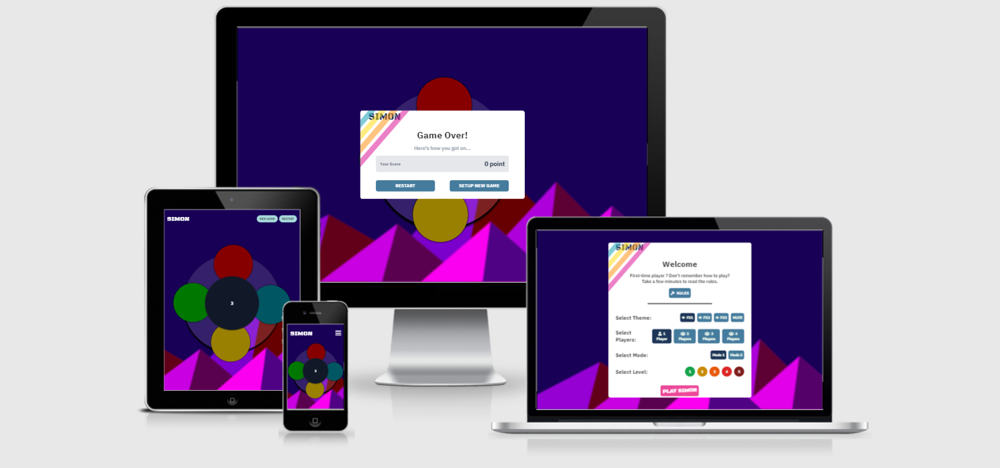

<h1 align="center">SIMON GAME</h1>

*This is the README file for SIMON game web application. You will find here a bunch of information regarding the Design, the technologies used and some informations regarding the gameplay.*

Simon is a memory game invented by Ralph H. Baer and Howard J. Morrison. The game creates a series of tones and lights and requires a user to repeat the sequence. If the user succeeds, the series becomes longer and more complex. Once the user fails or the time limit runs out, the game is over. 

Simon 2.0, is a web-based application game that I have created. I took the concept of the original game and turned it into a web application. In this new version of the game, the user has the possibility to choose a theme, a game mode, a level of difficulty. The game can be played with up to 4 people. 

The main goal of this game is fun and entertainment. I want the user to enjoy their time on the app and I want them to come back.

For a first-time player, I have written a set of rules that explain how to the game works.

[Check out the webste here.](https://travelling-potatoes.fr/dist)

<h1 align="center">Design</h1>

## User's needs

For this kind of application, the user's needs are really straightforward. First, the user want to understand how the game works quickly, without spending too much time reading the rules. 

The second need is to make sure the user enjoys the time they spend on the app. Finally, specifically for this game, the speed of execution is really important as the game speed will increase as the player is playing. 
        

## Website requirements
        
- Welcome window where the user can setup the game
- The game
- Score window
- Rules window

## Usage Scenario
        
- First-time Users

    When the user lands on the website for the first time, they will have the choice to read the rules of the game. The user must understand what the game is about and how it works and that without spneding more than 5 minutes reading the rules. During their first visit, the user must understand easily how to configure the game and how to play. 

- Returning Users
  
    The users that are coming back already know what Simon 2.0 is. The main goals for the returning users is to give them as much fun as possible and also giving them more complex challenges (level 3, 4, 5).

<h1 align="center">Design</h1>

## Wireframes

I used Figma to make the wireframe. 
  - Color palette
  - Setup page
  - Main page
  - Mobile main page

## Colors

The mains colors used on the website are dark blue, light blue and pink. The text is dark gray. 
These are the mains colors used on the website:

  - light: "#F1FAEE",
  - secondary: "#A8DADC",
  - primary: "#1D3557",
  - text: "#323232",
  - Second variant: "#457B9D",

## Typography

I have used 2 fonts on this appliation, the main one is "IBM Plex Sans" and second one is "Black Ops One".

## Illustrations/Media

There are only 2 illustrations on this website, the rest has been done using CSS. 
The first illustration is the main background, I have used this "website" to generate the svg background. The other illustration is the logo that I have created myself using Figma. 

In the project, I have used around 15 different sounds FX. These sounds have been created and designed by Raphael Teixeira and I have all the rights to use them.

<h1 align="center">Technologies</h1>

- HTML5
- CSS3
- TailwindCSS
- JavaScript
- jQeury
- PostCSS
- Webpack
- GIT

<h1 align="center">Features</h1>

In terms of features, the website uses tailswindCSS. This CSS framework, gives me the opportunity to write less CSS code and a better organisation of the differents classes. With tailwindCSS, I also used PostCSS which I use for the auto prefixer functionality. 

Regarding JavsScript, I have used jQuery and I wrote my code using javaScript ES6. In order to use ES6, I have installed webpack. 
Webpack will then buddle all my different JS files + jQuery into a main index.js file.

<h1 align="center">Testing</h1>

When the user arrives on the website's main page, they are welcomed by a modal window where they can configure the game. The users can choose the game's theme, the numbers of players, the level of difficulty and the mode they want to play in. They also have the possiblity to read the rules. 

When the user launches the game, if there are more than 1 player, a new modal will open for the users to enter the name of each player. If there is only a single player, the game will launch. 

During the game, if the players loose, the 'game over' modal will open displaying the results. On this modal, the user can either restart the game with the same configuration or set up a new game.

At any time during the game, the users car restart or set up the game using the button in the header. 

No bugs have been found in the application. 
 

<h1 align="center">Deployment</h1>

Simon game has been deployed on ... click here to check the live application.
You can close the project using the "git clone" command in your terminal and pasting ... http..//

This project use different technologies (webpack, tailwindCSS, jQuery etc..), in order to have a working version of the project on your local machine, please follow these steps using your terminal:

- clone the git repo on your local machine (git clone https://github.com/nyplex/Simon-game.git)
- cd into the project folder
- run "npm intall" , in order to install all the dependencies. 
- run "npm run build" in order to bundle all the files.
- those commands will create a node_modules folder and update the dist folder which contains the main files (js, css, html)
- you can open the index.html in the dist folder using your local server 

<h1 align="center">Credits</h1>

- MEDIA

    The sounds in the game have been created by Raphael Teixeira.

  
    
